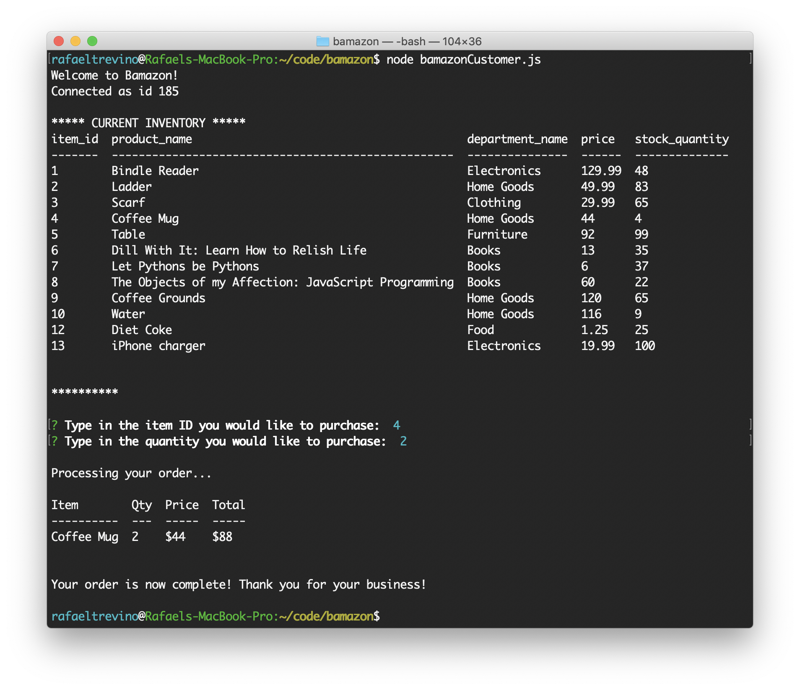
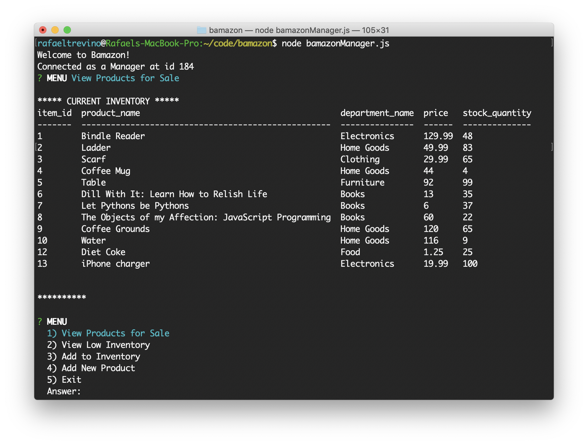

# Bamazon

This project runs a Node.js application for both Customers and Managers.

## Customers

[Click to see Customer Video](https://drive.google.com/file/d/1a9Rx_d69NWdeI_Tr7jHnrBozN9FT_bNo/view)

The Customer application shows the customer what is currently available in inventory. The customer is able to select an item by typing in its item ID and then the quantity to be purchased. If the quantity exceeds the inventory, the customer is diverted back to the initial prompt. If the quantity is equal to or less than what is in inventory, the customer’s order is processed, showing the tota amount for the purchase.

## Managers

[Click to see Manager Video](https://drive.google.com/file/d/12qvkbVwDIVkF42h-kiFQ1hUjlK_cu2hw/view)

The Manager application provides a menu of options for the manager:
1. **View Products for Sale.** Displays all available items in inventory, then diverts back to the initial menu.
2. **View Low Inventory.** Displays all items in inventory with 5 or fewer in stock.
3. **Add to Inventory.** Displays all available items in inventory, then asks the user for the item ID of the product to be replenished. The user then inputs the amount to be added to the current stock.
4. **Add New Product.** Allows the user to add a new product to the inventory by requesting its name, department, price, and current amount in stock. Afterward, the new inventory is displayed.
5. **Exit.** Disconnects the application and clears the console.

## Built With

* [Node.js](https://nodejs.org/en/)
* [mysql](https://www.npmjs.com/package/mysql)
* [inquirer](https://www.npmjs.com/package/inquirer)
  * A package for obtaining input from the user.
* [cTable](https://www.npmjs.com/package/console.table)
  * A package for formatting data as a table in the console.

## Who maintains the project
This project was created by [Rafael Treviño](https://github.com/rafaeltrevino/) as part of the Full-Stack Web Developer Coding Boot Camp program offered at the [George Washington University](https://bootcamp.cps.gwu.edu/coding/) in Arlington, Virginia.